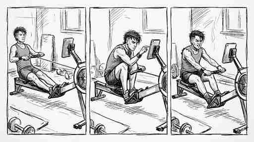

# Rowing Reader

Minimal webapp to render PDF, Markdown, or HTML with a locked viewport and controlled scrolling.



## Run

Use any static server (recommended) or open the file directly.

```bash
python -m http.server 8000
```

Then open `http://localhost:8000`.

## Local HTTPS (LAN)

Serve over HTTP and HTTPS on your local network with self-trusted certificates.

```bash
mkcert -install
mkdir -p certs
mkcert -cert-file certs/rowing-reader.local.pem \
  -key-file certs/rowing-reader.local-key.pem \
  192.168.1.178 rowing-reader.local

python serve_local.py
```

Defaults:

- HTTP: `http://<local-ip>:8123`
- HTTPS: `https://<local-ip>:8124`
- HTTP automatically redirects to HTTPS.

You can override the bind address and ports:

```bash
python serve_local.py --host 192.168.1.178 --http-port 8123 --https-port 8124
```

## Behavior

- The viewport never scrolls by wheel, touch, or keys.
- The only scroll actions are the lower-left and lower-right buttons (or Page Up / Page Down).
- Half toggle switches to two-column reading (PDF only).

## Notes

- PDF and Markdown rendering use CDN scripts (`pdf.js`, `marked`).
- For offline use, download those scripts and update the script tags in `index.html`.
